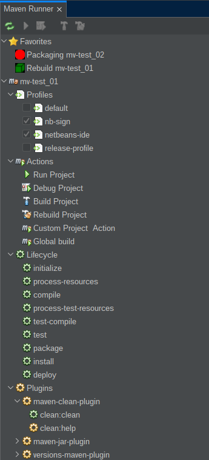
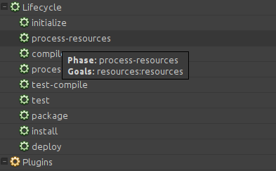

# Netbeans Maven Runner

This plugin is inspired by the IntelliJ IDEA Maven side panel.

## The Toolbar

The toolbar shows following buttons:

* **Refresh Tree:** Refresh the Maven-Runner tree
* **Run Project:** Runs the project currently selected in the Maven Runner
* **Debug Project:** Debugs the project currently selected in the Maven Runner
* **Build Project:** Builds the project currently selected in the Maven Runner
* **Clean and Build Project:** Rebuild the project currently selected in the Maven Runner

* **Expand all:** Expands all nodes in the Maven Runner
* **Collapse all:** Collapse all nodes in the Maven Runner

## Favorites

You add actions, goals etc. to the 'Favorites' node.

## Profiles

This node contains all declared profiles (pom.xml, settings.xml and configurations). 
The currently active profiles are marked with a selected checkbox.

## Actions

The *Actions* node contains the IDEs default actions *Run*, *Debug*, *Build*, 
*Clean and Build*, all the actions you have declared in the project and the 
action have defined in the Netbeans Maven options. You can run any action by 
double click.

Like the *Lifecycle*, the declared actions have a context menu, where you can 
change the behavior of the execution.

If you use the `Execute Goal With Modifiers...` you get the same dialog as in 
the Maven project context menu.

You find this behavior on all *Goals* (Actions, Lifecycle, Plugins).

## Lifecycle

The *Lifecycle* node contains all phases of the Maven lifecycle to which a goal 
is bound. You can see the bound goals in the tool tip.

## Plugins

This node contains the plugins and their goals. Each goal have a context menu 
entry `Show Documentation...` 

which shows the documentation of the plugin goal in the *Output* panel.

# Changelog

## 1.2.0
- Fix 'restore' view
- Add feature to use 'favorites'

## 1.1.0
- 'Real' project icons
- Update external libs

## 1.0.0

- First Version